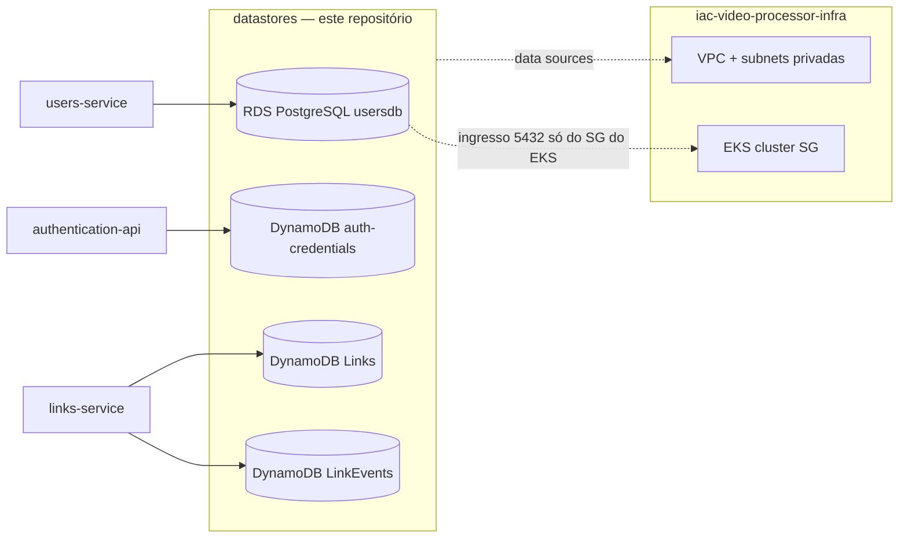

# iac-video-processor-data

Infraestrutura como código (Terraform) da **camada de persistência** do Tech Challenge FIAP X (Fase 5 — Hackathon, 13SOAT). Provisiona os bancos de dados da plataforma: o **RDS PostgreSQL** do domínio de usuários e as tabelas **DynamoDB** de credenciais (`auth-credentials`) e de links (`Links`, `LinkEvents`).

Repositório correspondente na organização: [`iac-video-processor-data`](https://github.com/13SOAT-andromeda/iac-video-processor-data).

---

## 1. Onde este repositório se encaixa na plataforma

Este é um dos repositórios de infraestrutura da arquitetura descrita em `arquitetura-video-processing-tech-challenge.md`. Ele é dono **exclusivamente dos datastores** — rede, cluster e mensageria vivem em repositórios separados:

| Repositório | Responsabilidade | Relação com este repositório |
|---|---|---|
| [`iac-video-processor-infra`](https://github.com/13SOAT-andromeda/iac-video-processor-infra) | VPC, EKS, ECR, filas/tópicos SNS/SQS, bucket S3 de vídeos, Ingress centralizado | **Pré-requisito**: a VPC `video-processor-vpc`, as subnets privadas e o security group do EKS são descobertos via `data sources` (não criados aqui) |
| [`iac-video-processor-gateway`](https://github.com/13SOAT-andromeda/iac-video-processor-gateway) | API Gateway HTTP API + REQUEST authorizer | Sem dependência direta — compartilha apenas o mesmo bucket de state S3 |
| [`video-processor-users-api`](https://github.com/13SOAT-andromeda/video-processor-users-api) | API + worker do domínio de usuários (pod no EKS) | Consome o **RDS PostgreSQL `usersdb`** provisionado aqui (endpoint injetado no deploy) |
| `video-processor-authorizer` / `video-processor-authentication-api` | Login/signup (Lambda) + validação de JWT (Lambda) | O `authentication` é o dono/escritor da tabela **`auth-credentials`** (DynamoDB) provisionada aqui |
| [`video-processor-link-api`](https://github.com/13SOAT-andromeda/video-processor-link-api) | Links de upload/download | Escritor exclusivo das tabelas **`Links`** e **`LinkEvents`** (DynamoDB) provisionadas aqui (ADR-007) |



**Princípio central (ADRs de posse de dados):** cada tabela tem um único serviço escritor — `users` pertence ao `users-service`, `auth-credentials` ao `authentication`, `Links`/`LinkEvents` ao `links-service`. Este repositório provisiona os datastores, mas **não cria schema de aplicação**: a tabela `users` nasce via `AutoMigrate` do próprio `users-service` no boot.

---

## 2. Recursos provisionados

### RDS PostgreSQL — `video-processor-users-db-<env>`

Módulo [`terraform-aws-modules/rds/aws`](https://registry.terraform.io/modules/terraform-aws-modules/rds/aws) (`~> 7.2`), em [`prod/rds.tf`](prod/rds.tf):

| Configuração | Valor |
|---|---|
| Engine | PostgreSQL 16, `db.t3.micro`, 20 GiB |
| Database / usuário master | `usersdb` / `dbadmin` — senha gerenciada pelo **Secrets Manager** (`manage_master_user_password`) |
| Rede | subnets privadas da `video-processor-vpc`, **não** público |
| Security group | ingresso **somente** na porta 5432 a partir do SG do cluster EKS (`video-processor-eks-<env>`) |
| Performance Insights | habilitado (retenção de 7 dias) — usa service-linked role da AWS, sem exigir `iam:CreateRole` (restrição do AWS Academy Lab) |
| Parameter group | `shared_preload_libraries = pg_stat_statements` + parâmetros de tracking, base do Datadog DBM (ver §6) |

### DynamoDB — módulo [`terraform-aws-modules/dynamodb-table/aws`](https://registry.terraform.io/modules/terraform-aws-modules/dynamodb-table/aws) (`~> 5.5`)

| Tabela | Chaves | Extras | Dono (escritor exclusivo) |
|---|---|---|---|
| `video-processor-auth-db-<env>` ([`dynamodb.tf`](prod/dynamodb.tf)) | hash `email` | `PAY_PER_REQUEST` | `authentication-api` |
| `video-processor-links-db-<env>` ([`links.tf`](prod/links.tf)) | hash `linkId` | GSI `userId-index` (consulta por dono do link), TTL nativo de 3 dias via `expiresAt` (ADR-002 v5 — sem job de limpeza) | `links-service` |
| `video-processor-link-events-db-<env>` ([`links.tf`](prod/links.tf)) | hash `linkId`, range `createdAt` | TTL via `expiresAt` | `links-service` |

---

## 3. Estrutura de pastas

```
dev/                     stage local — mesmos recursos, provider/backend apontando para LocalStack (localhost:4566)
prod/                    stage AWS real — backend S3 com lockfile, tags padrão via default_tags
prod/tests/              testes unitários de plano (terraform test + mock_provider)
prod/dbm_setup.sql       migração SQL one-shot do Datadog DBM (usuário datadog + grants + explain_statement)
docs/superpowers/        specs e plano de implementação (design do Terraform de dados)
```

`dev/` e `prod/` são **cópias com paridade intencional**: divergem apenas em backend/provider (LocalStack vs AWS), no nome da VPC (`video-processor-vpc-local` vs `video-processor-vpc`), no `environment` padrão (`localstack` vs `prod`) e no parameter group de DBM (só em `prod`).

---

## 4. Rodando localmente (LocalStack)

### Pré-requisitos

- Terraform >= 1.11
- LocalStack no ar em `localhost:4566`, **já com a base do `iac-video-processor-infra` (stage local) aplicada** — este repositório descobre a VPC `video-processor-vpc-local` e o SG do EKS via data sources, e usa o bucket `video-processor-bucket-andromeda-local` como backend de state

### Passo a passo

```bash
cd dev
terraform init
terraform plan
terraform apply
```

O provider do stage `dev` já embute credenciais fake (`test`/`test`) e os endpoints do LocalStack — nenhuma variável de ambiente é necessária.

> LocalStack Community emula a API do RDS mas não provisiona Performance Insights de verdade — o flag é um no-op inofensivo, mantido por paridade com `prod`.

---

## 5. Deploy em prod (AWS)

O backend S3 de `prod` é parametrizado (mesmo padrão dos repositórios `infra`/`gateway`) — o bucket é informado no `init`:

```bash
cd prod
terraform init -backend-config="bucket=<bucket-de-state>"
terraform plan
terraform apply
```

Pré-requisito: o stage `prod` do `iac-video-processor-infra` aplicado na mesma conta/região (`us-east-1`), pois a VPC `video-processor-vpc`, as subnets privadas (`*-private-*`) e o SG do EKS `video-processor-eks-prod` são resolvidos via data sources em [`prod/data.tf`](prod/data.tf).

Todos os recursos saem com as tags `Terraform=true`, `Environment=<env>` e `Project=video-processor` via `default_tags`.

> **AWS Academy Lab:** a conta é resetada periodicamente — após um reset, reaplicar o Terraform e reexecutar o `dbm_setup.sql` (§6).

---

## 6. Observabilidade (Datadog Database Monitoring)

A instrumentação do RDS para o DBM tem duas partes:

1. **Terraform** ([`prod/rds.tf`](prod/rds.tf)) — parameter group com `shared_preload_libraries = pg_stat_statements` (parâmetro estático: precisa estar no grupo com que a instância é **criada**, ou exige reboot — `apply_method = pending-reboot` cobre mudanças futuras), `pg_stat_statements.track = all`, `track_activity_query_size = 4096` e `track_io_timing = 1`, além do Performance Insights.
2. **SQL one-shot** ([`prod/dbm_setup.sql`](prod/dbm_setup.sql)) — deliberadamente fora do Terraform (é migração de banco, não infraestrutura): cria a extensão `pg_stat_statements`, o usuário `datadog` com `pg_monitor`, o schema `datadog` e a função `datadog.explain_statement` (`SECURITY DEFINER`) que permite ao Agent rodar `EXPLAIN` sem grants amplos nas tabelas da aplicação. Rodar **uma vez por instância RDS nova**:

```bash
psql "$DSN" -v datadog_password="$(openssl rand -base64 24)" -f prod/dbm_setup.sql
```

---

## 7. Testes

Testes unitários de plano com o framework nativo `terraform test` e `mock_provider` (sem tocar em AWS/LocalStack), em [`prod/tests/`](prod/tests):

```bash
cd prod
terraform init -backend=false
terraform test
```

Cobertura: security group do RDS (só 5432, só a partir do SG do EKS), configuração da instância (engine, subnets privadas, não-público), tabelas DynamoDB (chaves, GSI, TTL, billing mode) e os filtros dos data sources.

---

## 8. Outputs

Definidos em [`prod/outputs.tf`](prod/outputs.tf) — consumidos pelos workflows de deploy dos serviços:

| Output | Uso |
|---|---|
| `rds_identifier` / `rds_endpoint` | identificador e endpoint (`host:port`) do RDS — injetado como `DB_HOST`/`DB_PORT` no deploy do `users-service` |
| `rds_master_user_secret_arn` | ARN do secret (Secrets Manager) com as credenciais master do RDS |
| `auth_table_name` / `auth_table_arn` | tabela `auth-credentials` — consumida pelo `authentication-api` |
| `links_table_name` / `links_table_arn` | tabela `Links` — consumida pelo `links-service` |
| `link_events_table_name` / `link_events_table_arn` | tabela `LinkEvents` — consumida pelo `links-service` |
